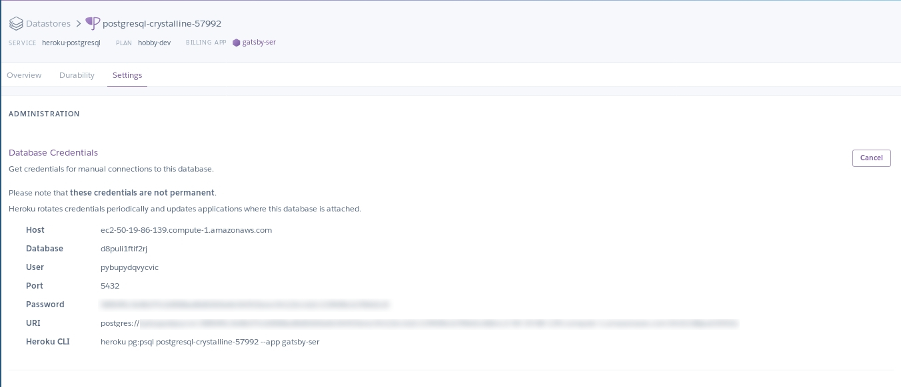

# Install Hasura Skor on Heroku

Hasura Skor can be installed and configured to connect to your existing postgres instance to receive events. This guide will help you configure skor to connect to the postgres instance running on Heroku.

## Install Skor

To install skor on Heroku, click the button below

## Configure skor to connect to your existing database

Skor requires `DATABASE_CONNECTION_STRING` and `WEBHOOKURL` to connect to the appropriate postgres instance. It can be passed as `Config Vars` to the app. You can get `DATABASE_CONNECTION_STRING` from [here](https://data.heroku.com/). 
  - Identify the postgres application you would like to connect to and copy the URI under `settings` tab

[Read more](https://github.com/hasura/skor/#1-set-up-the-triggers) to setup triggers and start processing the events.
